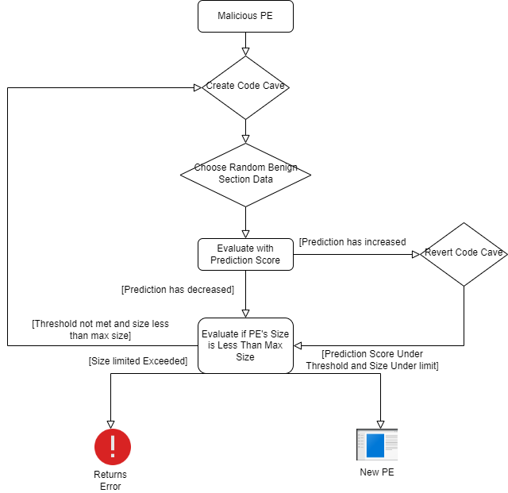
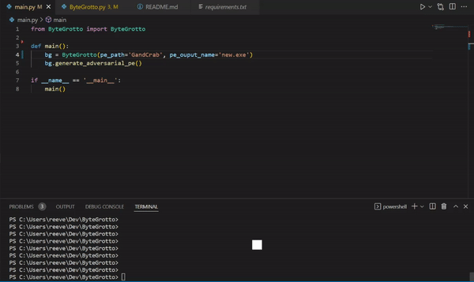
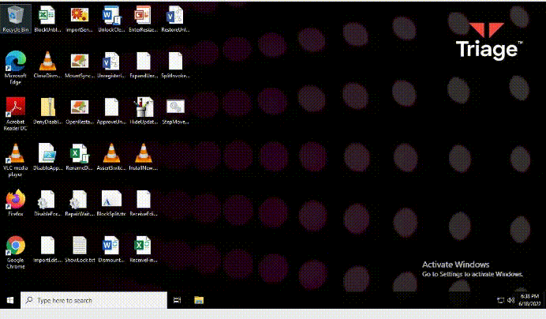

# ByteGrotto
Static AV-Evasion Via Code Cave Creation in Malware Portable Executables
<br/>
<br/>

>Comprehension follows perception.\
>\- *Phillip k. Dick* 


This repo is my rendition of the code cave creation static av-evasion technique first proposed by the paper [Optimization of code caves in malware binaries to evade machine learning detectors](https://www.sciencedirect.com/science/article/pii/S0167404822000426).


## Overview
Code cave creation within a Windows Portable Executable (PE) is an interesting technique to bypass malware classifiers which utilize the entire byte sequence or raw bytes of a PE as their input feature.  Code caves are the "slack space" or byte space within a PE section that is unused by the program, but is created in order to adhere to the `SectionAlignment` header within the PE.  All PE sections must adhere to the byte alignment specified by this header value and if the section data does not directly align itself on this boundary the compiler will add null bytes as padding to ensure that the section is the specified size.

<br/>

Code caves can be created by modifying the `RawAddress` variable within the each section's header.  Arbitrary data can then be added in between each section which can then be used to "confuse" malware classifiers which attempt to use an entire binary's raw data as an input feature.  

<br/>
<p align="center">
  
  <p align="center"><i>Representation of the memory mapping of the original sample and a modified version with unused spaces introduced by the attacker (Yuste et al., 2022)</i></p>
</p>

## How it Works
The ByteGrotto application will take any x32 or .NET PE and and create code caves with data randomly chosen form a set of data sections harvested from the SysWOW64 Windows directory. The reasoning behind this is that these sections will presumably contain data that is seemingly benign to machine learning classifiers.  The PE transformation is done strictly in memory and upon each code cave iteration the program will evaluate the changes and determine if the changes have either increased or decreased the prediction score of the classifier.  If the score has increased then the program revert the changes and try again and if the prediction score has decreased it will keep the modifications.  This cycle will continue unitl the threshold value has been reached.  

<br/>
<p align="center">
  
  <p align="center"><i>Flowchart for ByteGrotto's code cave method </i></p>
</p>

## Setup
To evaluate a PE against a model one will need to change the `evaluate` function within the `ByteGrotto` class.  Currently `ByteGrotto` is setup to run against the MalConv model.  
```python
    def evaluate(self):
        malconv = MalConvModel(MALCONV_MODEL_PATH, thresh=0.5)
        return malconv.predict(self.ba)
```

Example `main.py`
```python
from ByteGrotto import ByteGrotto

def main():
    bg = ByteGrotto(pe_path=<path to binary to modify>, pe_ouput_name=<output exe name>)
    bg.generate_adversarial_pe()

if __name__ == '__main__':
    main()
```

## Running
Below is a gif that demonstrates ByteGrotto in action.  A `GandCrab` malware variant was used for testing.  Upon each iteration the program outputs the `epoch`. `score` and `best` indicators.  The `epoch` it the current iteration, the `score` is the current prediction score and `best` is the prediction score to beat.
<p align="center">
  
  <p align="center"><i>ByteGrotto transforming a GandCrab variant</i></p>
</p>

Below is a gif verifying that the modified sample still runs.  The new sample is uploaded to a sandbox to ensure that the indicators of compromise match with the original code.
<p align="center">
  
  <p align="center"><i>GandCrab w/ code caves running in sandbox</i></p>
</p>
